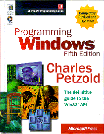

# Gnu Makefiles For Charles Petzold's Example Programs (Archive)

For the code given in the book **Programming Windows, Fifth Edition** by *Charles Petzold*, Microsoft® Press, November 11, 1998.

* ISBN-10: `157231995X` (`1-57231-995-X` as given on Petzold's site)
* ISBN-13: `978-1572319950`

[Charles Petzold's website](https://www.charlespetzold.com/pw5/) ([archive](https://web.archive.org/web/20240527163132/https://www.charlespetzold.com/pw5/)) mentions that **GNU Makefiles** for building the code examples from the book are available; *however*, the website linked to has recently gone away, though was [archived](https://web.archive.org/web/20240408162326/http://www.computersciencelab.com/Petzold.htm) by the Wayback machine many times. Still, finding these makefiles isn't easy if you don't think to check for an archived version.

> Programming Windows is a tutorial for programmers wishing to write applications for Windows using the C programming
> language and the native Win32 application programming interface (API). Programs written using this book run under
> every version of Windows from Windows 95 through Windows XP and beyond. Knowledge of C is required. 

> **Use the Book with Gnu Tools**
>
> The example programs in *Programming Windows* are designed to be compiled with Microsoft Visual C++.
> If you would prefer to use the open-source Gnu programming tools to compile the programs,
> [Gnu Makefiles For Charles Petzold's Example Programs](https://web.archive.org/web/20210702124020/http://www.computersciencelab.com/Petzold.htm)
> has complete instructions and downloads.
>
> That Web site also includes an Errata List. 

Below follows the text of the archived website:

---

# Gnu Makefiles For Charles  Petzold's Example Programs

 The most widely recommended book for learning to write Windows programs is Charles Petzold's <u>Programming Windows Fifth Edition</u>. This book teaches Microsoft's _**WIN32 API**_ (application programming interface) which is the infrastructure that Microsoft offers developers so they can accomplish the standard Windows user interface (graphical look and feel).

The Petzold book includes 145 example programs written in the C language. Mr. Petzold anticipated that readers of his book would purchase Microsoft's Visual C/C++ Compiler in order to compile his example programs. Unfortunately, this involves an outlay of at least $100 to Microsoft. Fortunately, there is available today a free alternative: the _**MinGW**_ ("Minimalist Gnu for Windows") project has ported the _**Gnu**_ tools -- which were developed for the UNIX/LINUX operating systems -- to the Windows environment. Because the Gnu project (homepage: [www.gnu.org](https://web.archive.org/web/20210702124020/http://www.gnu.org/)) and MinGW project (homepage: [www.mingw.org](https://web.archive.org/web/20210702124020/http://www.mingw.org/)) are both _**open source**_ efforts, anyone can download these tools for free.

Unfortunately, even after you have a free C (or C++) compiler you still have 2 problems. The first problem is that the Gnu compiler is a _**console-mode**_ tool which means that you must interface with it from a _**DOS box**_, which is the textual user interface provided by the old MS-DOS operating system. For example, to compile a file named Test.c you might need to type something like:

    gcc -g -D_DEBUG -DWIN32 -o Debug/Test.exe Test.c 

The solution to this problem is the use of an _**integrated development environment**_ (IDE) such as my CPPIDE. An IDE offers a graphical user interface with the conventional Windows look and feel. Instead of typing an arcane command you now accomplish a compile simply by clicking on a toolbar button.

The second problem is that Mr. Petzold provided the infrastructure that allows you to compile his 145 example programs using Microsoft's tools but a different infrastructure is required when using the Gnu tools. This infrastructure is known as a _**makefile**_. The makefile for a program encapsulates the knowledge of the exact recipe for compiling that program. Petzold provides makefiles for Microsoft's tools but we need Gnu style makefiles in order to use the free Gnu tools.

The solution to this problem is my gift to the world: 145 Gnu makefiles, one for each of the example programs in all 23 chapters (1450 pages!) of Petzold's book. I provide these 145 Gnu makefiles in a standard .ZIP file. Distributing these 145 .MAK files to the 145 different Petzold project folders is a job for automation. So I also freely distribute a Windows executable that unpacks the .ZIP file and copies the 145 makefiles to their necessary destinations. The instructions for using this executable and the hyperlink to download it are coming up, but first a few more details.

Petzold's 145 project folders already contain .DSP, .DSW, and .MAK files. The .DSP and .DSW files are needed to compile the projects with Microsoft's Visual C/C++ version 5, 6, or 7 compiler. These files are not touched by my installation program. But the .MAK files in Petzold's project folders are only useful with Visual C/C++ version 4, which I can't imagine anyone is still using since Microsoft is now shipping Visual C/C++ 7 (i.e. Visual C++.NET). So I don't bother preserving these .MAK files and instead I simply overwrite them. If someday you want them back then just pull them off Petzold's CD-ROM.

My installation program also removes the "read-only" attribute from all of the .C, .H and .EXE files in Petzold's folders (this attribute exists whenever files are copied from a CD-ROM). The Gnu compiler cannot rebuild the executable unless it is allowed to remove the original .EXE file. And by making the source code files (.C and .H files) writable, I allow you to experiment with Mr. Petzold's code.

My installation program also places 145 .PRJ files into the Petzold project folders. These .PRJ (project) files are infrastructure used with my CPPIDE integrated development environment. If you are using some other flavor of the Gnu tools then my makefiles will still work and the .PRJ files will just sit unused (they are extremely small). Here is an example of the command you would use to request a Release build if you are not going to employ my CPPIDE integrated development environment:

    make -f <filename.mak> 

And here is the command you would use to request a Debug build, again assuming you are not going to employ my CPPIDE integrated development environment:

    make -f <filename.mak> DEBUG=1 

If you are using my CPPIDE integrated development environment then you switch between the Debug and Release builds via a checkmark in a dialog box.

Finally, Mr. Petzold tried to get double-duty from his Debug and Release builds by arbitrarily deciding that all Debug builds would have the UNICODE macro defined and all Release builds would not. I suspect this has caused him more e-mail than any other decision since I am sure lots of people were confused why none of his pre-built Debug build programs would run under Windows 95/98/ME. And considering that Petzold doesn't even employ UNICODE in any meaningful way in any of his 145 example programs, this hidden trap just had to go. Therefore I don't define the UNICODE macro in my makefiles, period. If you want to experiment with UNICODE and create executables that can only be run under Windows 7, Vista, and XP then you are free to do so by either defining the UNICODE macro in Petzold's source files or in my .MAK files.

### Installation Instructions

Here is the procedure to get your computer set up to compile the Petzold programs with the Gnu tools. Start by inserting the CD-ROM that came with Petzold's Programming Windows Fifth Edition book. This is not an "auto-run" CD so nothing will start happening merely because you inserted the CD. Instead, you will need to manually copy the entire contents of Petzold's CD onto your hard drive. Use Microsoft's Windows Explorer (Start/Programs/Windows Explorer) for this job.

After Petzold's CD has been in your CD-ROM drive for a few seconds you will notice in Windows Explorer that your CD-ROM drive (which is probably drive letter D:) has been relabeled "ProgWin". This is the title of Petzold's CD. Double-click on this drive in the left-hand pane of Windows Explorer and the right-hand pane will then show you the top-level contents of this CD. The top-level contents of Petzold's CD consist of the following folders:

    Chap01
    Chap02
    Chap03
    ...
    Chap23
    EBook
    readme.txt 

Copy all of these folders onto your hard drive. As an example, you might choose to copy these folders into a new folder that you create named "C:\Petzold".

Only after the Petzold folders exist on your hard drive should you run my executable, which I call PetzoldConvert.exe. This executable, along with the PetzoldMakefiles.zip file that holds the 145 Gnu makefiles, is distributed in another .ZIP file called Petzold.zip, which you can obtain via the hyperlink below:

**[Download Petzold.zip here](./Petzold.zip)**

After clicking on this hyperlink choose "Save this file to disk" and then specify some temporary location. It doesn't matter where you place Petzold.zip as you will only need it briefly. If you have WinZip installed on your computer, then you can just double-click on Petzold.zip to unpack it. Again, it doesn't matter where you choose to place the unpacked contents, as you will only need these briefly. But what is important is that you keep the unpacked contents together in a single folder. These unpacked contents consist of the 8 following items:

    Images
    Wine
    Makefile
    PackingList.txt
    Petzold.htm
    PetzoldConvert.exe
    PetzoldMakefiles.zip
    Unzip.exe 

The Petzold.htm file is what you are reading now. You don't need to unpack the embedded .ZIP file named PetzoldMakefiles.zip as this will be done automatically.

What you need to do next depends upon whether you are installing on a Windows operating system or on a UNIX operating system such as LINUX (with the Wine emulator).

To install the Petzold programs under Windows, double-click on the executable, PetzoldConvert.exe . This program will present a dialog box where you will need to specify the location on your hard drive where you have placed all of the Petzold folders (in my example, this was "C:\Petzold"). Once you have specified this location you are ready to click on the "Install" pushbutton seen on this dialog. Note that on the Windows 7, Vista, and XP operating systems you must be an administrator to install software. Installation takes less than 1 minute. Should you later want to undo the effects of this installation, simply re-copy from Petzold's CD (this is sufficient because the installation program makes no changes to your Registry or Start menu).

In order to install under a UNIX operating system you need to follow the instructions found in the README file in the Wine folder.

## Issues When Using the Gnu Compiler With Petzold's Example Programs

Mr. Petzold did not design his programs to be compiled with the Gnu tools. Considering this fact, it is a testament to the quality of his coding that there are very few issues when porting these 145 programs to a new compiler. Here is the list of issues that I became aware of while preparing the 145 Gnu makefiles:

**Issue #1**

Petzold's .RC files #include the afxres.h file. This file is really part of MFC, which Petzold's program's don't employ. However the #include "afxres.h" statement was placed into Petzold's .RC files because Petzold used the Visual C/C++ 6 compiler's _**App Wizard**_ to develop his .RC files. [Petzold doesn't have kind words to say about Microsoft's wizards so it is ironic that they managed to bite him.] The code will not compile without an afxres.h file, and the MinGW environment provides no such file since it provides only a WIN32 implementation and not an MFC implementation.

I solved this problem by creating a 1 line afxres.h file and adding it to each of the projects that employ an .RC file. This is all taken care of automatically by my install program, PetzoldConvert.exe, so you don't have to do anything. You can look at these afxres.h files and you will see they consist of the statement:

    #include "winresrc.h" 

which references the file that should have been used in place of afxres.h in the first place.

**Issue #2**

Some of Petzold's source files (such as ScrnSize.c in Chapter 2) don't end with a newline ('\n') character. This causes the Gnu compiler to issue a warning:

    warning: no newline at end of file 

This warning can be ignored. If you want to eliminate it, go to the very end of the source file and add a carriage return.

**Issue #3**

The "head" program in Chapter 9 causes a warning from the compiler. You can either ignore this warning or else change:

    ReadFile( hFile, buffer, MAXREAD, &i;, NULL ); 

To:

    ReadFile( hFile, buffer, MAXREAD, (DWORD*)&i;, NULL ); 

**Issue #4**

The "HexCalc" program in Chapter 11 employs an .RC file convention that the Gnu resource compiler (windres.exe) doesn't recognize and flags as an error. To solve this "parse error" you must change the following line found in HexCalc.dlg:

    HexCalc DIALOG -1, -1, 102, 122 

to:

    HexCalc DIALOG 10, 10, 102, 122 

**Issue #5**

The "DevCaps2" program in Chapter 13 assumes that the macro CP_RECTANGLE will already be defined. But the Gnu/MinGW version of WINGDI.H does not define CP_RECTANGLE and this causes the compiler to declare a "CP_RECTANGLE undeclared" error. To fix this error you must add the following statement just prior to the initialization of the clip[ ] array in the DoOtherInfo() function found in the DevCaps2.c file:

    #define CP_RECTANGLE 1 

**Issue #6**

The "DibHeads" program in Chapter 15 employs the BITMAPV5HEADER struct which is supposed to be defined in WINGDI.H (as long as WINVER >= 0x0500). Unfortunately, the MinGW version of WINGDI.H does not yet include this struct definition (regardless of the value of WINVER). In order to compile this program using the Gnu tools you will need to add the following struct definition to the top of the DibHeads.c file right after the #include statements:

    #if (WINVER >= 0x0500)
    typedef struct {
    DWORD bV5Size;
    LONG bV5Width;
    LONG bV5Height;
    WORD bV5Planes;
    WORD bV5BitCount;
    DWORD bV5Compression;
    DWORD bV5SizeImage;
    LONG bV5XPelsPerMeter;
    LONG bV5YPelsPerMeter;
    DWORD bV5ClrUsed;
    DWORD bV5ClrImportant;
    DWORD bV5RedMask;
    DWORD bV5GreenMask;
    DWORD bV5BlueMask;
    DWORD bV5AlphaMask;
    DWORD bV5CSType;
    CIEXYZTRIPLE bV5Endpoints;
    DWORD bV5GammaRed;
    DWORD bV5GammaGreen;
    DWORD bV5GammaBlue;
    DWORD bV5Intent;
    DWORD bV5ProfileData;
    DWORD bV5ProfileSize;
    DWORD bV5Reserved;
    } BITMAPV5HEADER, FAR *LPBITMAPV5HEADER, *PBITMAPV5HEADER;
    #endif 

**Issue #7**

The "DibSect" program in Chapter 15 produces a warning about an "incompatible pointer type". You can either ignore this warning or else change:

    hBitmap = CreateDibSection( NULL, pbmi, DIB_RGB_COLORS, &pBits;, NULL, 0 ); 

to:

    hBitmap = CreateDibSection( NULL, pbmi, DIB_RGB_COLORS, (void*)&pBits;, NULL, 0 ); 

**Issue #8**

The "Dibble" program in Chapter 16 employs the BITMAPV5HEADER struct which is supposed to be defined in WINGDI.H (as long as WINVER >= 0x0500). Unfortunately, the MinGW version of WINGDI.H does not yet include this struct definition (regardless of the value of WINVER). In order to compile this program you will need to add the BITMAPV5HEADER struct definition that I have shown above. One place you can put it is at the top of the DibHelp.h file.

Furthermore, this program produces a warning about an "incompatible pointer type" unless you change:

    hBitmap = CreateDibSection( NULL, pbmi, DIB_RGB_COLORS, &pBits;, NULL, 0 ); 

to:

    hBitmap = CreateDibSection( NULL, pbmi, DIB_RGB_COLORS, (void*)&pBits;, NULL, 0 ); 

Furthermore, this program produces a warning about an "incompatible pointer type" unless you change:

    qsort( boxes, iEntry, sizeof( BOXES ), Compare ); 

to:

    typedef int (*compfn)(const void*, const void*);
    qsort( boxes, iEntry, sizeof( BOXES ), (compfn)Compare ); 

**Issue #9**

The Emf5, Emf6, and Emf7 programs in Chapter 18 produce an "incompatible pointer type" warning unless you change:

    EnumEnhMetaFile( hdcEMF, hemfOld, EnhMetaFileProc, NULL, (RECT*)&emh.rclBounds; ); 

to:

    EnumEnhMetaFile( hdcEMF, hemfOld, (ENHMFENUMPROC)EnhMetaFileProc, NULL, (RECT*)&emh.rclBounds; ); 

**Issue #10**

The "StrProg" program in Chapter 21 produces a "parse error before PVOID" error on line 18 of the STRLIB.H file. The problem is that the typedef on this line employs the PCTSTR data type which is not defined in the MinGW WINNT.H header file. This is apparently an oversight by the MinGW team since their WINNT.H header file does define all the other similar data types such as PSTR, PCSTR, PTSTR, LPCTSTR, etc. To eliminate the error you can either add at the top of STRLIB.H:

    typedef const TCHAR * PCTSTR; 

or else you can change line 18 of STRLIB.H from:

    typedef BOOL (CALLBACK * GETSTRCB) (PCTSTR, PVOID); 

to:

    typedef BOOL (CALLBACK * GETSTRCB) (LPCTSTR, PVOID); 

After making this change and recompiling you will then get a warning that line 152 of STRLIB.C is "passing arg 1 of pointer to function from [an] incompatible pointer type". This occurs because the GetStringsW() function employs the global szStrings variable, which is declared as a WCHAR array, as the first parameter passed to a GETSTRCB type function, whose first parameter must be -- when the UNICODE macro is not defined (as is the case here) -- a CHAR array. This warning can be ignored because when the UNICODE macro is not defined the GetStringW() function will never be called, instead GetStringA() will be called. When you do define the UNICODE macro the warning message shifts to a different line but can still be ignored.

The StrProg program will now compile and run. However, if you initiate multiple instances of this program they will not display each other's strings, as they will when you use the Microsoft compiler. Petzold wrote the program to demonstrate sharing of memory between two processes but the compiler pragma that he employs to accomplish this is not supported by the MinGW compiler.

**Issue #11**

The "UpdDemo" program in Chapter 23 produces an "incompatible pointer type" warning unless you change:

    qsort( plist->info, iNum, sizeof( FILEINFO ), Compare ); 

to:

    typedef int (*compfn)(const void*, const void*);
    qsort( plist->info, iNum, sizeof( FILEINFO ), (compfn)Compare ); 

**Note on the use of a C++ compiler**

Incidentally, well over half of Petzold's C language programs will compile without warnings with the Gnu C++ compiler. For those programs that do generate C++ compiler warnings, the typical resolution is to add a cast. For example, a statement such as:

    pBuffer = malloc (iFileLength + 2) 

merely needs to be changed to:

    pBuffer = (BYTE*)malloc (iFileLength + 2) 

**Note on the use of CPPIDE**

One of the nice features of the example C++ programs that I distribute with my CPPIDE integrated development environment, is that they will automatically size themselves so as to not overlap with the debugger when you are running these programs inside the Gnu GDB debugger.

Petzold's programs do not offer this feature. This means that when you debug one of Petzold's programs, it will not automatically size itself so that it does not overlap the debugger window. You will have to accomplish this yourself by dragging on the window's title bar and border. Unfortunately, if you are single-stepping the program then it won't have an opportunity to respond to this type of mouse input. Consequently, while you can compile and execute the Petzold programs, you will find it tough to single-step them within the debugger. But you can add the "auto-sizing" trick to one of Petzold's example programs via a pretty straight-forward cut and paste operation, as I explain [here](https://web.archive.org/web/20240408162326/http://www.computersciencelab.com/PetzoldFixup.htm). Even if you don't choose to make this modification in Petzold's programs, you will still learn an immense amount just from reading, compiling, and running these programs.

Finally, you need revision 1.3 of my Computer Science Lab CD-ROM in order to have a new enough version of CPPIDE for it to work seamlessly with the Petzold programs. This version only became available in 2/2003. If you have purchased a prior version of my CD I will ship you my latest CD if you just send me my standard shipping and handling charge of $3 (what a deal).

**Petzold book errata**

As a final public service, I post an errata list of book typos and program bugs [here](https://web.archive.org/web/20240408162326/http://www.computersciencelab.com/PetzoldErrata.htm).

